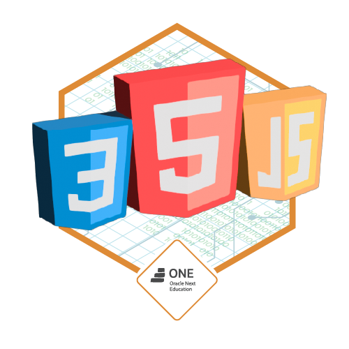

### 
  

   <h1> Portifolio Challenge Alura e Oracle</h2>
 

 

  

_Projeto desenvolvido para o Challenge do Bootcamp Alura e Oracle._

Para desenvolver este projeto utilizei às tecnologias **HTML**, **CSS**, **Flex** e **Javascript**

## Sobre o desafio

Esse projeto tem como objetivo a criação de um E-Commerce para praticar operações CRUD, focando nas partes de Create, Read e Delete (Criação, Leitura e Exclusão).

  

   <h2>Badge referente ao termino do Challenge</h2>
 

   

  

